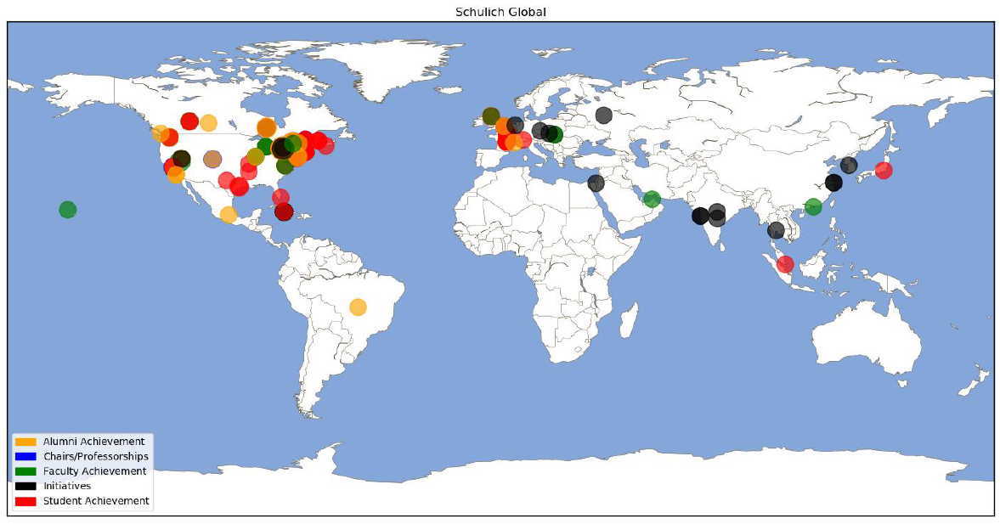

# Data-Visualization
First, import necessary modules as follows:

## **Geographical Chart:**
1) Import data \
      a. There are 5 columns in total: \
            i. Legend \
            ii. Year \
            iii. Impact Level \
            iv. Latitude \
            v. Longitude 
2) Set variables for *latitude*, *longitude*, and *level* of Schulich's impact worldwide. 
3) Parameterize *level* for better visualization. 
4) Create function that creates sixth column with the following properties: \
      a. For each Legends, assign colors accordingly to their corresponding rows.\
      
5) Create function that creates world-map with *level* plotted according to their latitude and longitude, and make them transparent.
6) Insert Legend and Title.
7) Call the function.\

### **Geographical Chart Output:**

## **Yearly Chart (aggregated by year):**
8) Create a separate Data Frame for the following Legends:\
      a. Alumni Achievement\
      b. Chairs/Professorships\
      c. Faculty Achievement\
      d. Initiatives\
      e. Student Achievement\
9) Aggregate *Level* by *Year*.\
10) Create function that plots each of the following Legends separately according to their designated colors.\
11) Insert axis label as well as the title.\
12) Call the function for the output.\

### **Yearly Chart (aggregated by year) Output:**

**Link to TIBCO Spotfire:**\
https://spotfire-next.cloud.tibco.com/spotfire/wp/ViewAnalysis.aspx?file=/Users/uzsacx6jwsgocmgxxjkyskttwqfbdg32/Public/Schulich%20Achievements&configurationBlock=SetPage%28pageIndex%3D0%29%3B&options=7-1,8-1,9-1,10-1,11-1,12-0,13-1,14-0,1-0,2-1,3-1,4-1,5-0,6-0,15-1,17-1

      
      

      
            
      

